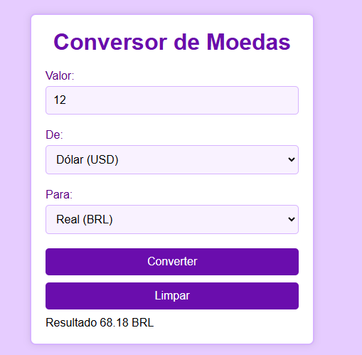

# Conversor de Moedas 2.0 com API

## Começando 🚀
Neste projeto, foi criado um Conversor de Moedas Versão 2.0 com integração de API na seguinte matéria:
* Programação Web I.

## Sobre o projeto 📋
Este projeto é um Conversor de Moedas que facilita o cálculo de valores convertidos em tempo real entre diferentes moedas. Diferente da versão anterior, que foi um [Sistema de Conversor sem uso de API](https://github.com/gabriellefagundes/conversor-moeda), esta aplicação integra uma API de câmbio, permitindo consultas de taxa de conversão sempre atualizadas e precisas, refletindo as variações do mercado.

## Código JavaScript.
### Estrutura Principal: Chave da API e URL Base
* A variável apiKey armazena a chave da API necessária para autenticação.
* apiURL é a URL base da ExchangeRate API, à qual é adicionada a moeda de origem durante a consulta.
### Função getExchangeRate(daMoeda, paraMoeda)
* Essa função assíncrona realiza a consulta da taxa de câmbio para a moeda selecionada.
### Processo:
* Faz uma requisição fetch para a API, usando a URL e a moeda de origem.
* A resposta é convertida em JSON, verificando se o resultado foi um sucesso (data.result === "success").
* Retorna a taxa de câmbio da moeda de origem para a moeda de destino. Se houver um erro, o console exibe a mensagem e a função retorna null.
### Manipulação do Formulário para Conversão
* Um listener de evento submit é adicionado ao formulário de conversão de moedas (currency-form). Ao submeter o formulário:
* Previne o comportamento padrão do formulário com event.preventDefault().
* Coleta os valores: valor a ser convertido (amount), moeda de origem (from-currency) e moeda de destino (to-currency).
* Chama getExchangeRate para buscar a taxa de câmbio e, se for bem-sucedido, calcula o valor convertido (valor * exchangeRate).
* O resultado é exibido no elemento conversao, formatado com duas casas decimais.
* Em caso de falha, exibe uma mensagem de erro ao usuário.

## Imagens do projeto.

 Essa é a tela (única) do projeto.
 
 Esse é o conversor funcionando perfeitamente.

## Técnicas e Tecnologias utilizadas 🔨
* Visual Studio Code
* Git Bash
* GitHub
* HTML5
* CSS3
* JavaScript (Puro)
* Live Server (A extensão Live Server permite criar um servidor local através do VSCode, facilitando o desenvolvimento sem a necessidade de atualizar manualmente o navegador a cada alteração no código)

## Autores ✍🏻
| [ Larissa Gabrielle Fagundes Andrade.](https://github.com/gabriellefagundes) |
| :---: 
## Meu LinkedIn:
|  [ LinkedIn.](https://www.linkedin.com/in/larissa-gabrielle-a74a272b3/)
| :---: 